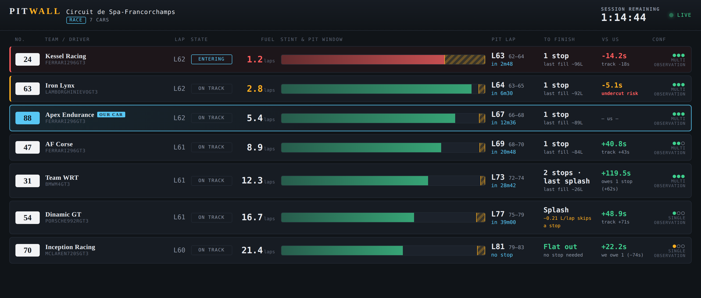
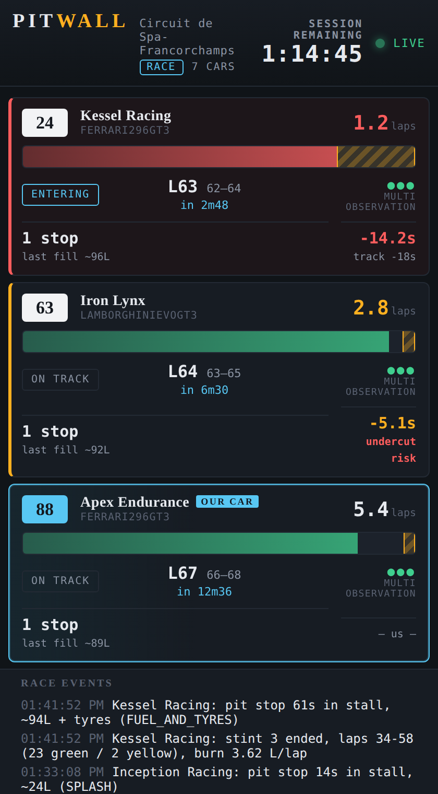

# WIP PitWall -- iRacing GT3 pit stop predictor

Predicts when every car in the field will pit by inferring competitor fuel
state from stint lengths and pit stall durations, and shares the live
predictions with your team via a web dashboard.

## Layout

    client/   runs on the iRacing PC
      pit_prediction.py          prediction engine (no dependencies)
      run_pit_predictor.py       pyirsdk runner: console display + relay uplink
      references.example.json    per-car/track fuel reference template
    relay/    runs on your server (OVH), in Docker
      server.py                  FastAPI: ingest + SSE fanout + dashboard
      static/index.html          team dashboard
      Dockerfile, docker-compose.yml, .env.example

## The dashboard

Open `pitwall-dashboard-preview.html` in a browser to see this live with
sample data -- no server required.

Cars are sorted by urgency: whoever must pit soonest is at the top. Your own
car is outlined in cyan and tagged **OUR CAR**, wherever it falls in that
order (it stays in the sort so you can see who stops before and after you).

### Reading a row

| Column | What it tells you |
|---|---|
| **No. / Team** | Car number and team, from the session roster. Car model underneath. |
| **Lap / State** | Current lap, and whether the car is on track, entering the pits, in its stall, or exiting. |
| **Fuel** | Laps of fuel left. Turns amber under 3 laps, red under 1.5, and the row picks up a matching left edge. |
| **Stint & pit window** | The signature element -- see below. |
| **Pit lap** | Best-estimate pit lap, the min–max window beneath it, and a countdown in minutes. |
| **To finish** | Stops still needed to see the flag, and how big the last one is. |
| **Vs us** | Net seconds versus your car once everyone has served their remaining stops. |
| **Conf** | How much the estimate rests on observation rather than assumption. |

### The stint bar

Each bar is one car's current stint. The green fill grows as fuel burns
down; it turns red when the car is nearly dry. The hatched amber band is the
predicted pit window (min to max), with a solid amber line at the
best-estimate lap.

**The width of that band is the uncertainty.** Before a car's first stop it
is wide, because the model is running on reference numbers alone. Each fuel
stop it makes calibrates its personal burn rate, and the band visibly
narrows -- usually to about a lap by its second stop. A car whose band is
still wide late in the race is one whose stops have been splashes, damage,
or penalties: nothing the model could learn from.

### "To finish" -- the strategic column

This is the column that decides races, and it becomes meaningful once a car
has made its first stop and its burn rate is known.

- **Flat out** (green) -- enough fuel to reach the flag. No stop coming.
- **1 stop** / **2 stops** -- with `last fill ~71L` beneath, the size of the
  final stop. A small last fill means a short stop: they lose less time than
  a rival taking a full tank.
- **Splash** -- the last stop is a few seconds of fuel and no tyres.
- **−0.21 L/lap skips a stop** (amber) -- the warning line. This car is
  marginal: if they lift and coast by that much per lap, their final stop
  disappears entirely. These are the rivals whose strategy can change without
  warning, and the amber is there so you spot them while there is still time
  to respond.

### "Vs us" -- net position after all stops

Track position lies during an endurance race. A car 30 seconds behind you
that still owes an extra stop is not racing you; a car 5 seconds behind on
the same strategy is.

This column resolves that: **net = current track gap + (their remaining pit
time − ours)**. Green means you finish ahead once everything shakes out, red
means behind, amber means it is a genuine fight. The line underneath explains
why -- `owes 1 stop (+62s)`, `we owe 1 (−74s)`, or just the raw track gap
when strategies match.

A red **undercut risk** warning appears when a rival is close enough behind
to jump you in the pits and their window opens at least two laps before
yours. That is the moment to consider reacting.

Pace differences are deliberately kept out of the net figure (they are shown
on hover instead). Pit-stop time is arithmetic; extrapolating a lap-time
delta over an hour is a guess, and mixing the two would make the number look
more certain than it is.

### Confidence

Three pips, filled as a car's burn rate is confirmed by observed stops, with
the basis spelled out underneath:

- `PRIOR ONLY` -- reference-table assumption, no stops seen yet.
- `SINGLE OBSERVATION` -- one calibrating stop.
- `MULTI OBSERVATION` -- two or more; treat these as solid.

Amber pips mean the car's fuel anchor is uncertain -- typically after the
client restarted and missed a stop. Its bands stay wide until its next
observed stop re-anchors it.

### Header and event feed

The header carries the track, session type, car count, session time
remaining, and a status light: green **Live** while snapshots arrive, amber
**Pit box offline** if the client stops sending. The feed at the bottom logs
every stop as it is classified -- stall duration, litres inferred, whether
tyres went on -- plus stint summaries with the burn rate that stint produced.
That log is the quickest way to sanity-check the model mid-race.

### On a phone

Rows restack into three tiers -- identity and fuel, the stint bar, then the
strategy figures -- so the whole field stays scannable one-handed on the pit
wall.

## Server (OVH)

    cd relay
    cp .env.example .env        # set INGEST_TOKEN and VIEW_TOKEN
    docker compose up -d --build

Dashboard: http://<server>:8000/?key=<VIEW_TOKEN>

To check the deployment before race day, start it with DEMO=1 in .env --
the relay generates a sample race itself, so the dashboard is live without
any iRacing client connected. Unset DEMO for real use.
Ingested events append to relay/data/events.jsonl on the host (bind-mounted
at /data in the container) for post-race analysis -- feed it straight to
tools/replay.py. The container writes as ${PUID:-1000}:${PGID:-1000}, so if
your deploy user is not uid 1000, set PUID/PGID in .env to match; otherwise
the append fails silently and the race is not recorded. For HTTPS put Caddy
in front:
    your.domain { reverse_proxy pitwall:8000 }

## Client (iRacing PC)

    pip install pyirsdk
    cd client
    copy references.example.json references.json   (edit for your cars/tracks;
                                  VRS subscribers: tools/README.md documents a
                                  tool that fills rows from your datapacks)
    python run_pit_predictor.py --refs references.json --state drivers.json ^
        --server http://<server>:8000 --token <INGEST_TOKEN>

Flags:
    --refs    reference table; one complete row per (car, track) pair --
              no wildcard rows, every row carries the car's tank/refuel/
              tyre numbers as well as the track's burn and pace numbers.
              car_id and track_id are matched EXACTLY against the session
              YAML: car_id is CarPath ("ferrari296gt3"), track_id is
              TrackName -- track folder plus config, lowercase, space
              separated ("spa grandprix", "spielberg gp"), not the display
              name ("Red Bull Ring"). A car with no matching row falls back
              to generic GT3 numbers, so watch the event log at startup: it
              names every miss and quotes the exact string to paste in.
    --state   persists burn factors + stint anchors; enables full mid-race
              recovery after a crash (same subsession) and warm-starts
              known drivers in future races
    --server / --token   relay uplink; omit both to run standalone
    --demo    simulated 3-car session to test without iRacing

## Testing the predictions (practice / test sessions)

Just run the client in any session type -- race, practice, AI, or a solo
test drive. When your own car is on track, an OWN-CAR CHECK line appears
under the header:

    OWN-CAR CHECK: model 42.1L vs actual 40.8L (d +1.3L)  |  burn 3.45 vs 3.51 L/lap (d-0.06)

Your own car's PREDICTION does not use that inference: whenever your
FuelLevel reading is live, fuel on board is read straight from the gauge
and burn from the median of your last few green laps -- the row shows
basis MEASURED at high confidence, and a practice run on a partial load
is predicted correctly. The check line keeps running the competitor-style
inference as a shadow model and scores it against the gauge. Burn delta
near zero means the reference row for your car/track is well tuned; the
"actual" burn figure is the number to paste into baseline_burn_l_per_lap.
The measured laps also continuously calibrate the shadow model, so when
the gauge dies (teammate driving, see below) predictions degrade to an
inference that has been trained on your real consumption. Session rotation
(practice -> qualifying -> race) and car resets are handled automatically;
burn factors carry across, stint tracking restarts.

## Team races

FuelLevel is cockpit telemetry: it is only live on the PC of the member
currently driving. For a two-driver lineup, run the client on BOTH
drivers' PCs with the same --server/--token. Each client stamps its
uploads with whether its own member is in the car, and the relay keeps
the active driver's feed and drops the passive one -- so the dashboard
always follows the client that can see the real fuel gauge, and the feed
hands over automatically at every driver swap. The passive client keeps
its engine warm from the shared telemetry (competitor inference needs no
cockpit data), so nothing is lost in the handover; its own-car numbers
just run on the calibrated inference until its driver climbs back in.

A client on a non-driving member's PC (spotter setup) still works, but
its own-car predictions stay inference-based the whole race -- the gauge
never goes live there. If a PC must change mid-race, start the client on
the new machine with the same --server/--token: it pulls the recovery
state from the relay automatically and continues where the old PC left
off.

## Notes

- tank_capacity_l must be the BoP-effective capacity (physical tank x max
  fuel pct). The runner warns if the live value for your own car disagrees
  with the reference table.
- Splash stops, drive-throughs, tows and driver-swap-inflated stall times
  are classified and excluded from burn calibration automatically.
- After a crash/restart within the same subsession, state restores from
  drivers.json; cars that pitted unseen are re-anchored via missed-pit
  inference and carry widened prediction bands until their next observed stop.
